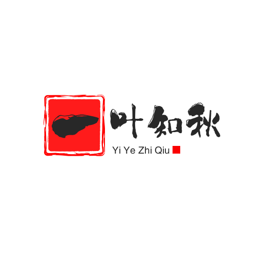

<div align="center">
	
</div>

# react 管理后台模板

项目基于react18、react routerv6、redux、typescript 进行开发,实现快速开发,只要熟悉简单的react语法即可开发项目.

项目中可动态修改颜色、水印、面包屑、适配移动端界面

项目配置了多个打包环境,可配置指定文件进行打包,亦可自行调整.
- .env.development 开发环境
- .env.test 测试环境
- .env.pred 预发布环境
- .env.production 生产环境

## 本地运行
```bash
# 安装依赖
yarn

# 运行
yarn dev
```

## 项目打包
```bash
# 测试环境
yarn build:test
# 预发布环境
yarn build:pred
# 生产环境
yarn build:production
```

